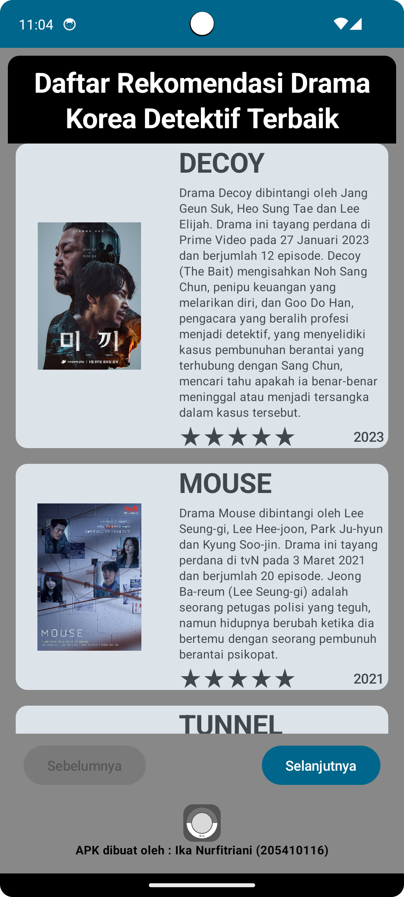
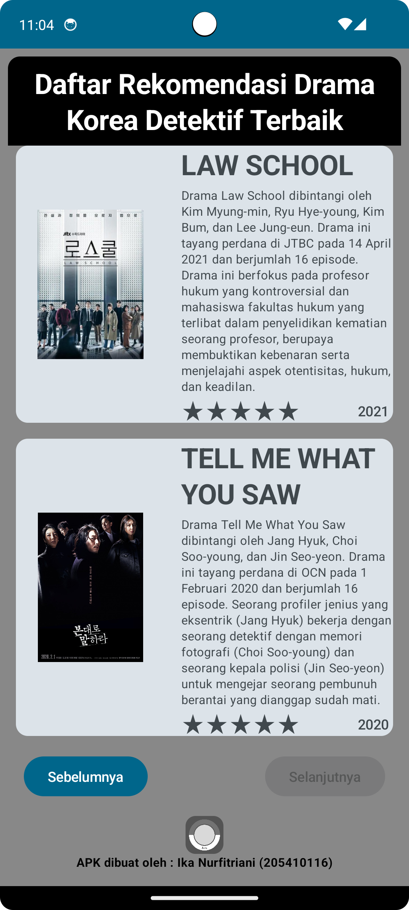
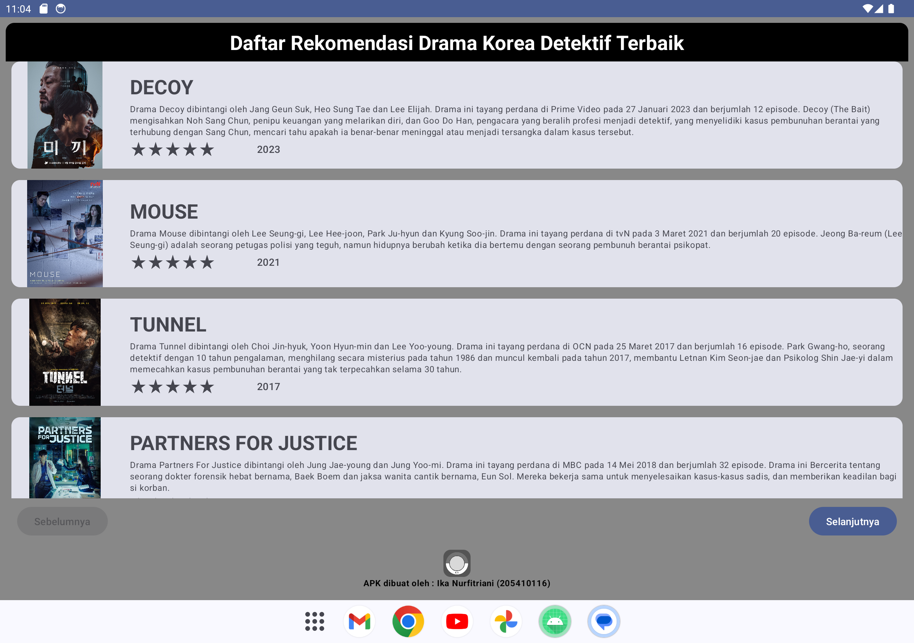

# KoreanDramas
Hai, perkenalkan saya Ika Nurfitriani! Repositori ini merupakan hasil latihan projek kelas dengan referensi berasal dari codelab. Hasil projek berupa projek aplikasi Android yang diberi nama Korean Dramas. Aplikasi ini menampilkan daftar rekomendasi drama korea detektif terbaik beserta informasinya.

# Fitur-Fitur
- Home: Aplikasi menampilkan rekomendasi drama korea detektif terbaik dengan poster, judul, deskripsi singkat, tahun rilis dan rating dari drama.

# Screenshot Aplikasi
Berikut ini adalah hasil screenshot dari aplikasi Korean Dramas:

  

## Author
[@Ika Nurfitriani](https://github.com/ikanurfitriani)